# **PromptAtrium Marketplace & Credits System**
## Product Requirements Document (PRD)
### Version 1.0 | December 2024

---

## 📋 **Table of Contents**

1. [Executive Summary](#executive-summary)
2. [Vision & Objectives](#vision-objectives)
3. [Market Analysis](#market-analysis)
4. [User Personas](#user-personas)
5. [Product Features](#product-features)
6. [Technical Architecture](#technical-architecture)
7. [Credits Economy System](#credits-economy)
8. [User Journeys](#user-journeys)
9. [Monetization Strategy](#monetization)
10. [Implementation Roadmap](#implementation-roadmap)
11. [Risk Assessment](#risk-assessment)
12. [Success Metrics](#success-metrics)
13. [Compliance & Legal](#compliance-legal)
14. [Appendices](#appendices)

---

## 1. 📝 **Executive Summary** {#executive-summary}

### **Product Overview**
PromptAtrium Marketplace transforms the existing prompt management platform into a comprehensive economic ecosystem where creators monetize their AI prompts while maintaining community-driven sharing through an innovative credits system.

### **Key Innovation**
A hybrid dual-currency marketplace combining traditional payments (USD via Stripe) with a gamified credits system, creating multiple pathways for value exchange and community engagement.

### **Target Outcomes**
- **Year 1 GMV**: $1M+ in transactions
- **Active Sellers**: 2,000+ creators
- **Platform Revenue**: $150K+ (15% commission + credit sales)
- **User Engagement**: 3x increase in DAU

### **Investment Required**
- **Development**: 16-20 weeks (3 developers)
- **Design**: 4-6 weeks (1 designer)
- **Legal/Compliance**: $10-15K initial setup
- **Marketing**: $25K launch budget

---

## 2. 🎯 **Vision & Objectives** {#vision-objectives}

### **Vision Statement**
"To become the premier marketplace for AI prompts, where creativity meets commerce, and community contribution is valued alongside monetary transactions."

### **Strategic Objectives**

#### **Primary Goals**
1. **Economic Empowerment**: Enable creators to build sustainable income from prompt engineering
2. **Community Growth**: 10x user base through credits-driven viral mechanics
3. **Platform Sustainability**: Achieve profitability within 12 months
4. **Market Leadership**: Capture 30% of AI prompt marketplace share

#### **Secondary Goals**
- Establish quality standards for AI prompts industry
- Build largest prompt dataset for AI research
- Create educational ecosystem for prompt engineering
- Foster international creator community

### **Success Criteria**
- 50,000+ registered users (Year 1)
- 10,000+ active listings
- 85%+ transaction success rate
- 4.5+ average platform rating
- <2% dispute rate

---

## 3. 📊 **Market Analysis** {#market-analysis}

### **Market Size & Opportunity**

#### **TAM (Total Addressable Market)**
- Global AI content creation market: $15B (2024)
- Prompt engineering subset: $500M
- Annual growth rate: 45% CAGR

#### **SAM (Serviceable Addressable Market)**
- English-speaking creators: $200M
- Professional prompt engineers: 100,000+
- AI enthusiasts: 5M+

#### **SOM (Serviceable Obtainable Market)**
- Year 1 target: $5M GMV
- Year 2 projection: $25M GMV
- Year 3 projection: $75M GMV

### **Competitive Landscape**

#### **Direct Competitors**
- **PromptBase**: First mover, limited features
- **PromptHero**: Community-focused, no commerce
- **Lexica**: Image-focused, subscription model

#### **Competitive Advantages**
1. **Dual Currency System**: Unique credits mechanism
2. **Integrated Platform**: Creation + marketplace
3. **Community Features**: Social + commerce
4. **Quality Curation**: AI-powered moderation
5. **Developer-Friendly**: API access planned

---

## 4. 👥 **User Personas** {#user-personas}

### **Primary Personas**

#### **1. Professional Prompt Engineer ("Sarah")**
- **Demographics**: 28-35, tech-savvy, $50-100K income
- **Goals**: Monetize expertise, build reputation
- **Pain Points**: Lack of platforms, pricing uncertainty
- **Value Prop**: Professional tools, analytics, steady income

#### **2. Content Creator ("Mike")**
- **Demographics**: 22-30, social media active
- **Goals**: Consistent AI outputs, time savings
- **Pain Points**: Prompt quality variance, trial-and-error
- **Value Prop**: Proven prompts, instant results

#### **3. Hobbyist Contributor ("Emma")**
- **Demographics**: 25-40, creative enthusiast
- **Goals**: Share creations, learn from community
- **Pain Points**: No recognition, limited reach
- **Value Prop**: Credits rewards, community status

#### **4. Business Buyer ("David")**
- **Demographics**: 30-50, marketing/design role
- **Goals**: Professional assets, commercial rights
- **Pain Points**: Licensing confusion, bulk needs
- **Value Prop**: Clear licensing, bulk discounts

### **Secondary Personas**
- AI Researchers (data access)
- Educators (curriculum content)
- Agencies (white-label prompts)
- Developers (API integration)

---

## 5. 🛠️ **Product Features** {#product-features}

### **Core Marketplace Features**

#### **5.1 Seller Hub**

**Listing Management**
- Single & bundle prompt listings
- Version control & updates
- A/B pricing experiments
- Scheduled publishing
- Bulk operations

**Analytics Dashboard**
- Real-time sales tracking
- Conversion funnel analysis
- Customer demographics
- Performance metrics
- Revenue projections

**Marketing Tools**
- Promotional campaigns
- Discount codes
- Email marketing integration
- Social media sharing
- Affiliate program

#### **5.2 Buyer Experience**

**Discovery & Search**
- AI-powered recommendations
- Advanced filtering system
- Visual preview gallery
- Try-before-buy samples
- Similar prompt suggestions

**Purchase Flow**
- One-click checkout
- Cart & wishlist
- Gift purchases
- Subscription options
- Bulk licensing

**Post-Purchase**
- Instant delivery
- Cloud storage
- Version updates
- Download center
- API access

#### **5.3 Trust & Safety**

**Quality Assurance**
- Automated testing
- Community verification
- Professional review tier
- Plagiarism detection
- Output validation

**Dispute Resolution**
- Automated mediation
- Escrow protection
- Refund system
- Escalation process
- Arbitration option

### **Credits System Features**

#### **5.4 Earning Mechanisms**

**Content Rewards**
| Action | Credits | Frequency |
|--------|---------|-----------|
| Share prompt | 50-200 | Per prompt |
| Quality bonus | +100 | Per 100 likes |
| Featured content | +500 | Weekly selection |
| Collection curation | 100 | Per collection |
| Prompt translation | 50 | Per translation |

**Engagement Rewards**
| Action | Credits | Frequency |
|--------|---------|-----------|
| Daily login | 10 | Daily |
| 7-day streak | 100 | Weekly |
| 30-day streak | 500 | Monthly |
| Review writing | 10-25 | Per review |
| Helpful vote | 5 | Per vote received |

**Achievement System**
| Achievement | Credits | Requirement |
|------------|---------|-------------|
| First Steps | 100 | First prompt |
| Rising Star | 500 | 10 prompts |
| Expert | 2000 | 50 prompts |
| Influencer | 5000 | 1000 followers |
| Top Seller | 10000 | $1000 sales |

#### **5.5 Spending Options**

**Marketplace Uses**
- Purchase prompts
- Unlock previews (10 credits)
- Priority listing (500/week)
- Featured placement (1000/month)
- Custom requests

**Platform Benefits**
- Ad-free experience (500/month)
- Early access (200/feature)
- Priority support (100/ticket)
- Storage upgrade (1000/year)
- API access (5000/month)

---

## 6. 🏗️ **Technical Architecture** {#technical-architecture}

### **System Architecture**

```
┌─────────────────────────────────────────────────────────┐
│                     Frontend (React)                      │
├─────────────────────────────────────────────────────────┤
│                   API Gateway (Express)                   │
├──────────────┬────────────────┬────────────────┬────────┤
│  Auth Service│ Marketplace API│  Credits API   │Storage │
├──────────────┼────────────────┼────────────────┼────────┤
│ Replit OIDC  │  Stripe Connect│ Transaction Mgr│  GCS   │
├──────────────┴────────────────┴────────────────┴────────┤
│                PostgreSQL (Drizzle ORM)                  │
└─────────────────────────────────────────────────────────┘
```

### **Database Schema**

#### **Core Tables**

```sql
-- Marketplace Core
marketplace_listings (
  id VARCHAR PRIMARY KEY,
  prompt_id VARCHAR REFERENCES prompts(id),
  seller_id VARCHAR REFERENCES users(id),
  title VARCHAR NOT NULL,
  description TEXT,
  price_cents INTEGER,
  credit_price INTEGER,
  accepts_money BOOLEAN DEFAULT true,
  accepts_credits BOOLEAN DEFAULT true,
  preview_percentage INTEGER DEFAULT 20,
  tags TEXT[],
  category VARCHAR,
  status VARCHAR CHECK (status IN ('draft','active','paused','deleted')),
  sales_count INTEGER DEFAULT 0,
  total_revenue_cents INTEGER DEFAULT 0,
  total_credits_earned INTEGER DEFAULT 0,
  average_rating DECIMAL(3,2),
  review_count INTEGER DEFAULT 0,
  featured_until TIMESTAMP,
  created_at TIMESTAMP DEFAULT NOW(),
  updated_at TIMESTAMP DEFAULT NOW()
);

-- Seller Profiles  
seller_profiles (
  user_id VARCHAR PRIMARY KEY REFERENCES users(id),
  stripe_account_id VARCHAR UNIQUE,
  onboarding_status VARCHAR,
  verification_level VARCHAR,
  business_type VARCHAR,
  tax_info JSONB,
  payout_method VARCHAR,
  payout_schedule VARCHAR,
  minimum_payout_cents INTEGER DEFAULT 1000,
  total_sales INTEGER DEFAULT 0,
  total_revenue_cents INTEGER DEFAULT 0,
  total_credits_earned INTEGER DEFAULT 0,
  average_rating DECIMAL(3,2),
  response_time_hours INTEGER,
  featured_seller BOOLEAN DEFAULT false,
  seller_tier VARCHAR,
  commission_rate DECIMAL(4,2) DEFAULT 15.00,
  created_at TIMESTAMP DEFAULT NOW()
);

-- Orders & Transactions
marketplace_orders (
  id VARCHAR PRIMARY KEY,
  order_number VARCHAR UNIQUE,
  buyer_id VARCHAR REFERENCES users(id),
  seller_id VARCHAR REFERENCES users(id),
  listing_id VARCHAR REFERENCES marketplace_listings(id),
  payment_method VARCHAR CHECK (payment_method IN ('stripe','credits')),
  stripe_payment_intent_id VARCHAR,
  amount_cents INTEGER,
  credit_amount INTEGER,
  platform_fee_cents INTEGER,
  platform_fee_credits INTEGER,
  seller_payout_cents INTEGER,
  seller_payout_credits INTEGER,
  status VARCHAR,
  delivered_at TIMESTAMP,
  reviewed_at TIMESTAMP,
  refunded_at TIMESTAMP,
  refund_reason VARCHAR,
  dispute_id VARCHAR,
  metadata JSONB,
  created_at TIMESTAMP DEFAULT NOW()
);

-- Digital Licenses
digital_licenses (
  id VARCHAR PRIMARY KEY,
  order_id VARCHAR REFERENCES marketplace_orders(id),
  prompt_id VARCHAR REFERENCES prompts(id),
  buyer_id VARCHAR REFERENCES users(id),
  license_key VARCHAR UNIQUE,
  license_type VARCHAR,
  usage_rights JSONB,
  commercial_use BOOLEAN,
  modification_allowed BOOLEAN,
  resale_prohibited BOOLEAN DEFAULT true,
  attribution_required BOOLEAN,
  max_uses INTEGER,
  expires_at TIMESTAMP,
  revoked_at TIMESTAMP,
  created_at TIMESTAMP DEFAULT NOW()
);

-- Credits System
user_credits (
  user_id VARCHAR PRIMARY KEY REFERENCES users(id),
  balance INTEGER DEFAULT 0 CHECK (balance >= 0),
  lifetime_earned INTEGER DEFAULT 0,
  lifetime_spent INTEGER DEFAULT 0,
  lifetime_purchased INTEGER DEFAULT 0,
  pending_credits INTEGER DEFAULT 0,
  locked_until TIMESTAMP,
  last_activity TIMESTAMP,
  created_at TIMESTAMP DEFAULT NOW(),
  updated_at TIMESTAMP DEFAULT NOW()
);

credit_transactions (
  id VARCHAR PRIMARY KEY,
  user_id VARCHAR REFERENCES users(id),
  type VARCHAR CHECK (type IN ('earn','spend','purchase','refund','expire','admin')),
  amount INTEGER NOT NULL,
  balance_before INTEGER,
  balance_after INTEGER,
  source VARCHAR,
  reference_type VARCHAR,
  reference_id VARCHAR,
  description TEXT,
  metadata JSONB,
  expires_at TIMESTAMP,
  created_at TIMESTAMP DEFAULT NOW()
);

-- Reviews & Ratings
marketplace_reviews (
  id VARCHAR PRIMARY KEY,
  order_id VARCHAR REFERENCES marketplace_orders(id),
  listing_id VARCHAR REFERENCES marketplace_listings(id),
  reviewer_id VARCHAR REFERENCES users(id),
  rating INTEGER CHECK (rating BETWEEN 1 AND 5),
  title VARCHAR,
  comment TEXT,
  verified_purchase BOOLEAN DEFAULT true,
  helpful_count INTEGER DEFAULT 0,
  unhelpful_count INTEGER DEFAULT 0,
  seller_response TEXT,
  seller_responded_at TIMESTAMP,
  flagged_at TIMESTAMP,
  moderation_status VARCHAR,
  created_at TIMESTAMP DEFAULT NOW(),
  updated_at TIMESTAMP DEFAULT NOW()
);

-- Analytics & Tracking
marketplace_analytics (
  id VARCHAR PRIMARY KEY,
  listing_id VARCHAR REFERENCES marketplace_listings(id),
  date DATE,
  views INTEGER DEFAULT 0,
  clicks INTEGER DEFAULT 0,
  add_to_cart INTEGER DEFAULT 0,
  purchases INTEGER DEFAULT 0,
  revenue_cents INTEGER DEFAULT 0,
  credits_earned INTEGER DEFAULT 0,
  conversion_rate DECIMAL(5,2),
  average_time_on_page INTEGER,
  traffic_source JSONB,
  created_at TIMESTAMP DEFAULT NOW()
);
```

### **API Endpoints**

#### **Marketplace APIs**

```typescript
// Listing Management
POST   /api/marketplace/listings
GET    /api/marketplace/listings/:id
PUT    /api/marketplace/listings/:id
DELETE /api/marketplace/listings/:id
GET    /api/marketplace/my-listings

// Discovery
GET    /api/marketplace/search
GET    /api/marketplace/categories
GET    /api/marketplace/featured
GET    /api/marketplace/trending
GET    /api/marketplace/recommendations

// Transactions
POST   /api/marketplace/checkout
POST   /api/marketplace/checkout/credits
GET    /api/marketplace/orders
GET    /api/marketplace/orders/:id
POST   /api/marketplace/orders/:id/deliver
POST   /api/marketplace/orders/:id/refund

// Seller Management
GET    /api/marketplace/seller/dashboard
GET    /api/marketplace/seller/analytics
GET    /api/marketplace/seller/payouts
POST   /api/marketplace/seller/withdraw

// Reviews
POST   /api/marketplace/reviews
GET    /api/marketplace/reviews/:listingId
PUT    /api/marketplace/reviews/:id
POST   /api/marketplace/reviews/:id/helpful
```

#### **Credits System APIs**

```typescript
// Balance Management
GET    /api/credits/balance
GET    /api/credits/history
POST   /api/credits/purchase
GET    /api/credits/packages

// Earning
POST   /api/credits/claim/daily
POST   /api/credits/claim/achievement
GET    /api/credits/achievements
GET    /api/credits/leaderboard

// Spending
POST   /api/credits/spend
GET    /api/credits/pricing/:listingId
```

### **Third-Party Integrations**

#### **Stripe Connect Setup**

```javascript
// Platform Configuration
{
  account_type: "standard",
  capabilities: {
    card_payments: { requested: true },
    transfers: { requested: true }
  },
  business_type: "individual",
  tos_acceptance: { 
    date: Math.floor(Date.now() / 1000),
    ip: request.ip 
  }
}

// Payment Flow
1. Create PaymentIntent
2. Capture payment
3. Create Transfer to seller
4. Handle platform fee
5. Update order status
6. Trigger delivery

// Webhook Events
- payment_intent.succeeded
- payment_intent.payment_failed
- account.updated
- transfer.created
- payout.paid
```

#### **Storage Architecture**

```
Google Cloud Storage Buckets:
├── marketplace-assets/
│   ├── listing-previews/
│   ├── listing-galleries/
│   └── seller-profiles/
├── purchased-content/
│   ├── full-prompts/
│   ├── digital-assets/
│   └── license-docs/
└── user-uploads/
    ├── temp/
    └── processed/
```

---

## 7. 💰 **Credits Economy System** {#credits-economy}

### **Economic Model**

#### **Credit Valuation**
- **Base Rate**: 100 credits = $1.00 USD
- **Inflation Control**: Quarterly adjustment based on metrics
- **Supply Management**: Dynamic earning rates
- **Demand Stimulation**: Limited-time offers

#### **Purchase Packages**

| Package | Price | Credits | Bonus | Value |
|---------|-------|---------|-------|-------|
| Starter | $5 | 500 | 0% | $0.010/credit |
| Popular | $10 | 1,100 | 10% | $0.009/credit |
| Value | $25 | 2,875 | 15% | $0.0087/credit |
| Pro | $50 | 6,000 | 20% | $0.0083/credit |
| Enterprise | $100 | 13,000 | 30% | $0.0077/credit |

#### **Earning Schedule**

**Daily Caps**
- Maximum daily earn: 500 credits
- Review limit: 10 reviews/day
- Helpful votes: 50/day
- Referral limit: 5/day

**Quality Multipliers**
- 5-star content: 2x base reward
- 4-star content: 1.5x base reward
- 3-star content: 1x base reward
- Below 3-star: 0.5x base reward

### **Gamification Mechanics**

#### **Level System**
| Level | Credits Required | Title | Perks |
|-------|-----------------|-------|-------|
| 1 | 0 | Novice | Basic features |
| 5 | 1,000 | Contributor | 5% credit bonus |
| 10 | 5,000 | Creator | 10% credit bonus |
| 20 | 20,000 | Expert | 15% credit bonus |
| 30 | 50,000 | Master | 20% credit bonus |
| 50 | 150,000 | Legend | 25% credit bonus |

#### **Seasonal Events**

**Monthly Themes**
- January: New Year Challenge (2x credits)
- February: Love & Art (themed prompts)
- March: Spring Creation (nature focus)
- April: Innovation Month (tech prompts)
- May: Mother's Day (family themes)
- June: Pride Celebration (diversity)
- July: Summer Vibes (vacation)
- August: Back to School (education)
- September: Harvest Festival (abundance)
- October: Halloween (spooky)
- November: Gratitude (thankfulness)
- December: Holiday Magic (festive)

#### **Community Challenges**

**Weekly Challenges**
- Theme prompt creation
- Review marathon
- Referral race
- Quality improvement
- Collaboration contest

**Rewards Pool**
- 1st place: 5,000 credits
- 2nd place: 3,000 credits
- 3rd place: 1,500 credits
- Participation: 100 credits

### **Economic Balance**

#### **Credit Sinks**
- Featured listings (500-2000 credits)
- Premium previews (10-50 credits)
- Priority support (100 credits)
- Storage upgrades (1000 credits/year)
- Vanity items (badges, themes)
- Gift credits (with 10% tax)

#### **Anti-Inflation Measures**
- Credit expiration (12 months)
- Graduated earning rates
- Dynamic pricing adjustments
- Periodic credit sales
- Exclusive credit-only content

---

## 8. 🗺️ **User Journeys** {#user-journeys}

### **Seller Journey**

```mermaid
graph LR
    A[Sign Up] --> B[Complete Profile]
    B --> C[Stripe Onboarding]
    C --> D[Create First Listing]
    D --> E[Set Pricing]
    E --> F[Add Previews]
    F --> G[Publish Listing]
    G --> H[Receive Order]
    H --> I[Auto-Deliver]
    I --> J[Get Paid]
    J --> K[View Analytics]
    K --> L[Optimize Listings]
```



### **Buyer Journey**

```mermaid
graph LR
    A[Browse Marketplace] --> B[Search/Filter]
    B --> C[View Listing]
    C --> D[Check Preview]
    D --> E[Read Reviews]
    E --> F[Add to Cart]
    F --> G[Choose Payment]
    G --> H[Complete Purchase]
    H --> I[Access Content]
    I --> J[Download/Use]
    J --> K[Leave Review]
```



### **Credit Earner Journey**


---

## 9. 💸 **Monetization Strategy** {#monetization}

### **Revenue Streams**

#### **Primary Revenue**

| Source | Model | Rate | Projection Y1 |
|--------|-------|------|---------------|
| Transaction Fees | Commission | 15% | $150,000 |
| Credit Sales | Direct | 30% margin | $50,000 |
| Featured Listings | Subscription | $20/month | $30,000 |
| Premium Sellers | Subscription | $50/month | $40,000 |

#### **Secondary Revenue**

| Source | Model | Rate | Projection Y1 |
|--------|-------|------|---------------|
| API Access | Usage-based | $0.001/call | $20,000 |
| White Label | License | $500/month | $30,000 |
| Data Insights | Subscription | $200/month | $15,000 |
| Advertising | CPM | $5 CPM | $10,000 |

### **Pricing Strategy**

#### **Dynamic Pricing Algorithm**

```python
def calculate_suggested_price(prompt):
    base_price = 5.00
    
    # Quality factors
    if prompt.rating >= 4.5:
        base_price *= 1.5
    elif prompt.rating >= 4.0:
        base_price *= 1.2
    
    # Demand factors
    if prompt.category in high_demand:
        base_price *= 1.3
    
    # Complexity factors
    if len(prompt.variables) > 5:
        base_price *= 1.2
    
    # Competition factors
    similar_avg = get_similar_prompts_avg_price()
    base_price = (base_price + similar_avg) / 2
    
    return round(base_price, 2)
```

#### **Commission Structure**

| Seller Tier | Monthly Sales | Commission |
|------------|---------------|------------|
| Starter | <$100 | 20% |
| Regular | $100-500 | 15% |
| Pro | $500-2000 | 12% |
| Elite | $2000-5000 | 10% |
| Partner | >$5000 | 8% |

### **Growth Strategy**

#### **User Acquisition**

**Launch Phase (Months 1-3)**
- Influencer partnerships (50 creators)
- Reddit/Discord community outreach
- Free credits promotion ($10K budget)
- Press release to tech media

**Growth Phase (Months 4-9)**
- Referral program (250 credits/user)
- Content marketing (SEO blog)
- YouTube tutorials
- Affiliate program (10% commission)

**Scale Phase (Months 10-12)**
- Paid advertising (Google, Meta)
- Partnership with AI platforms
- B2B enterprise sales
- International expansion

---

## 10. 📅 **Implementation Roadmap** {#implementation-roadmap}

### **Development Phases**

#### **Phase 1: Foundation (Weeks 1-4)**

**Week 1-2: Infrastructure**
- [ ] Database schema setup
- [ ] Stripe Connect integration
- [ ] Basic API structure
- [ ] Authentication updates

**Week 3-4: Core Marketplace**
- [ ] Listing creation flow
- [ ] Basic search/browse
- [ ] Simple checkout
- [ ] Order management

**Deliverables**: MVP marketplace with basic buy/sell

#### **Phase 2: Credits System (Weeks 5-8)**

**Week 5-6: Credit Infrastructure**
- [ ] Credit wallet system
- [ ] Transaction logging
- [ ] Purchase packages
- [ ] Basic earning rules

**Week 7-8: Gamification**
- [ ] Achievement system
- [ ] Daily rewards
- [ ] Leaderboards
- [ ] Level progression

**Deliverables**: Full credits economy live

#### **Phase 3: Advanced Features (Weeks 9-12)**

**Week 9-10: Seller Tools**
- [ ] Analytics dashboard
- [ ] Promotional tools
- [ ] Bulk management
- [ ] Payout system

**Week 11-12: Buyer Experience**
- [ ] Advanced search
- [ ] Recommendations
- [ ] Collections
- [ ] Wishlist

**Deliverables**: Feature-complete marketplace

#### **Phase 4: Optimization (Weeks 13-16)**

**Week 13-14: Performance**
- [ ] Caching layer
- [ ] Search optimization
- [ ] CDN setup
- [ ] Load testing

**Week 15-16: Polish**
- [ ] UI/UX refinement
- [ ] Mobile optimization
- [ ] Bug fixes
- [ ] Documentation

**Deliverables**: Production-ready platform

### **Testing Strategy**

#### **Test Phases**

| Phase | Duration | Focus | Participants |
|-------|----------|-------|--------------|
| Alpha | 2 weeks | Core flows | 10 internal |
| Beta 1 | 2 weeks | Seller tools | 25 creators |
| Beta 2 | 2 weeks | Full platform | 100 users |
| Stress | 1 week | Performance | Automated |
| UAT | 1 week | Final validation | 50 users |

#### **Success Criteria**
- <2% transaction failure rate
- <500ms page load time
- >95% uptime
- <1% critical bugs
- >4.0 user satisfaction

---

## 11. ⚠️ **Risk Assessment** {#risk-assessment}

### **Technical Risks**

| Risk | Impact | Probability | Mitigation |
|------|--------|-------------|------------|
| Payment failures | High | Medium | Stripe retry logic, multiple payment methods |
| Performance issues | High | Medium | Caching, CDN, database optimization |
| Security breach | Critical | Low | Regular audits, encryption, 2FA |
| Data loss | Critical | Low | Automated backups, disaster recovery |
| API abuse | Medium | Medium | Rate limiting, API keys, monitoring |

### **Business Risks**

| Risk | Impact | Probability | Mitigation |
|------|--------|-------------|------------|
| Low seller adoption | High | Medium | Incentive program, marketing push |
| Quality control | High | Medium | Moderation, ratings, verification |
| Legal issues | High | Low | Clear terms, legal review, insurance |
| Competition | Medium | High | Unique features, fast iteration |
| Credit inflation | Medium | Medium | Dynamic rates, sinks, monitoring |

### **Compliance Risks**

| Risk | Impact | Probability | Mitigation |
|------|--------|-------------|------------|
| Tax compliance | High | Medium | Stripe Tax, professional advice |
| GDPR violations | High | Low | Privacy policy, data controls |
| Content copyright | Medium | Medium | DMCA process, verification |
| Financial regulations | High | Low | Stripe compliance, legal review |
| Age restrictions | Medium | Low | Age verification, parental controls |

---

## 12. 📊 **Success Metrics** {#success-metrics}

### **Key Performance Indicators (KPIs)**

#### **Business Metrics**

| Metric | Target (Month 1) | Target (Month 6) | Target (Year 1) |
|--------|------------------|------------------|-----------------|
| GMV | $5,000 | $50,000 | $1,000,000 |
| Active Users | 1,000 | 10,000 | 50,000 |
| Active Sellers | 50 | 500 | 2,000 |
| Active Listings | 200 | 2,000 | 10,000 |
| Transaction Volume | 100 | 2,000 | 50,000 |
| Platform Revenue | $750 | $7,500 | $150,000 |

#### **Engagement Metrics**

| Metric | Target | Measurement |
|--------|--------|-------------|
| DAU/MAU Ratio | >25% | Daily/Monthly Active Users |
| Session Duration | >10 min | Average time on platform |
| Purchase Conversion | >3% | Visitors to buyers |
| Repeat Purchase Rate | >40% | Multi-purchase users |
| NPS Score | >40 | Net Promoter Score |
| Review Rate | >30% | Orders with reviews |

#### **Credits Metrics**

| Metric | Target | Purpose |
|--------|--------|---------|
| Credit Circulation | 1M/month | Economic health |
| Earn/Spend Ratio | 0.8-1.2 | Balance indicator |
| Credit Purchase Rate | >10% | Monetization |
| Average Credit Balance | 500-1000 | Engagement |
| Credit Velocity | 30 days | Turnover rate |

### **Monitoring & Reporting**

#### **Dashboards**

**Executive Dashboard**
- GMV trend
- User growth
- Revenue breakdown
- Platform health

**Operations Dashboard**
- Transaction status
- Dispute queue
- Moderation backlog
- System performance

**Seller Dashboard**
- Individual metrics
- Comparative analytics
- Growth suggestions
- Payout status

---

## 13. ⚖️ **Compliance & Legal** {#compliance-legal}

### **Terms of Service Updates**

#### **Marketplace Agreement**

**Seller Terms**
- Content ownership
- License grants
- Prohibited content
- Commission structure
- Payout terms
- Dispute process

**Buyer Terms**
- Purchase terms
- License rights
- Refund policy
- Acceptable use
- Dispute process

#### **Credits Terms**
- Virtual currency nature
- No cash value
- Expiration policy
- Transfer restrictions
- Termination effects

### **Privacy & Data Protection**

#### **GDPR Compliance**
- Explicit consent flows
- Data portability
- Right to deletion
- Privacy by design
- Data minimization

#### **CCPA Compliance**
- Disclosure requirements
- Opt-out mechanisms
- Non-discrimination
- Data sale disclosure

### **Financial Compliance**

#### **Payment Processing**
- PCI DSS compliance (via Stripe)
- Anti-money laundering (AML)
- Know Your Customer (KYC)
- Tax reporting (1099-K)

#### **International Considerations**
- VAT/GST collection
- Currency conversion
- Export restrictions
- Sanctions compliance

---

## 14. 📎 **Appendices** {#appendices}

### **Appendix A: Technical Specifications**

#### **Performance Requirements**
- Page load: <2 seconds
- API response: <200ms
- Search results: <500ms
- Upload speed: >1MB/s
- Concurrent users: 10,000+

#### **Security Requirements**
- SSL/TLS encryption
- 2FA authentication
- Rate limiting
- OWASP compliance
- Regular penetration testing

### **Appendix B: UI/UX Guidelines**

#### **Design System**
- Dark theme primary
- Card-based layouts
- Animated borders (subtle)
- Consistent spacing (8px grid)
- Accessible colors (WCAG AA)

#### **Component Library**
- Marketplace cards
- Price displays
- Credit indicators
- Achievement badges
- Analytics charts

### **Appendix C: API Documentation**

#### **Authentication**
```http
POST /api/auth/login
Authorization: Bearer {token}
```

#### **Marketplace Endpoints**
```http
GET /api/marketplace/listings
POST /api/marketplace/checkout
GET /api/marketplace/orders/{id}
```

#### **Credits Endpoints**
```http
GET /api/credits/balance
POST /api/credits/earn
POST /api/credits/spend
```

### **Appendix D: Database Migrations**

```sql
-- Migration 001: Create marketplace tables
CREATE TABLE marketplace_listings ...
CREATE TABLE seller_profiles ...

-- Migration 002: Add credits system
CREATE TABLE user_credits ...
CREATE TABLE credit_transactions ...

-- Migration 003: Add analytics
CREATE TABLE marketplace_analytics ...
CREATE INDEX idx_analytics_date ...
```

### **Appendix E: Third-Party Services**

| Service | Purpose | Cost | Critical |
|---------|---------|------|----------|
| Stripe | Payments | 2.9% + $0.30 | Yes |
| Google Cloud | Storage | $0.02/GB | Yes |
| SendGrid | Email | $15/month | No |
| Sentry | Monitoring | $26/month | No |
| Algolia | Search | $50/month | No |

---

## 📝 **Document Control**

**Version History**
- v1.0 - Initial PRD (Current)
- v0.9 - Draft review
- v0.8 - Stakeholder feedback

**Approval Chain**
- Product Owner: Pending
- Technical Lead: Pending
- Legal Review: Pending
- Executive Approval: Pending

**Next Review Date**: January 15, 2025

---

## **Summary**

This comprehensive PRD provides a complete roadmap for implementing the PromptAtrium Marketplace with an integrated credits system. The hybrid economy model creates multiple value exchange pathways while maintaining sustainable monetization. With your existing technical infrastructure, this implementation is highly feasible and can be executed in a phased approach over 16-20 weeks.

The combination of traditional commerce and gamified credits creates a unique competitive advantage that will drive both user engagement and revenue growth.

### **Key Success Factors**
1. **Dual Currency Innovation** - Credits + Cash hybrid model
2. **Community-Driven Growth** - Viral mechanics and rewards
3. **Quality Curation** - Trust and safety measures
4. **Scalable Architecture** - Built on solid technical foundation
5. **Clear Monetization** - Multiple revenue streams

### **Next Steps**
1. Review and approve PRD with stakeholders
2. Secure budget and resources
3. Begin Phase 1 technical implementation
4. Recruit alpha/beta testers
5. Prepare marketing launch strategy